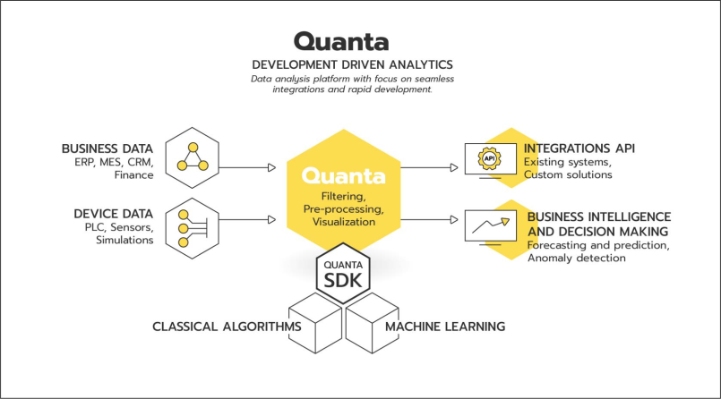

# Quanta 

Quanta is an open source data analytics platform with a focus on algorithm development and seamless integration between business systems. 

## Installing

### Requirements

Quanta uses TimescaleDB as a default database. Postgres or other JDBC compliant databases should also work, but may behave unexpectedly.

You can run TimescaleDB via CLI using Docker Compose

`docker-compose up -d`

### Docker

Easiest way to run Quanta is via Docker. We have versioned Docker images in Docker Hub.

You can run Quanta from CLI using command

`docker run -it --env-file=.env --net=host jubicoy/quanta`

Note! This command is only for testing purposes, you should avoid using `--net=host` in production environments.

## Configuration

### Environment Variables
`JOOQ_URL`

Connection string for internal database. 

`JOOQ_USER`

Internal database username.

`JOOQ_PASSWORD`

Internal database password.

`SERVER_HOST`

Server host IP-address.

`ADMIN_USERNAME`

Web interface admin username.

`ADMIN_PASSWORD`

Web interface admin password.

